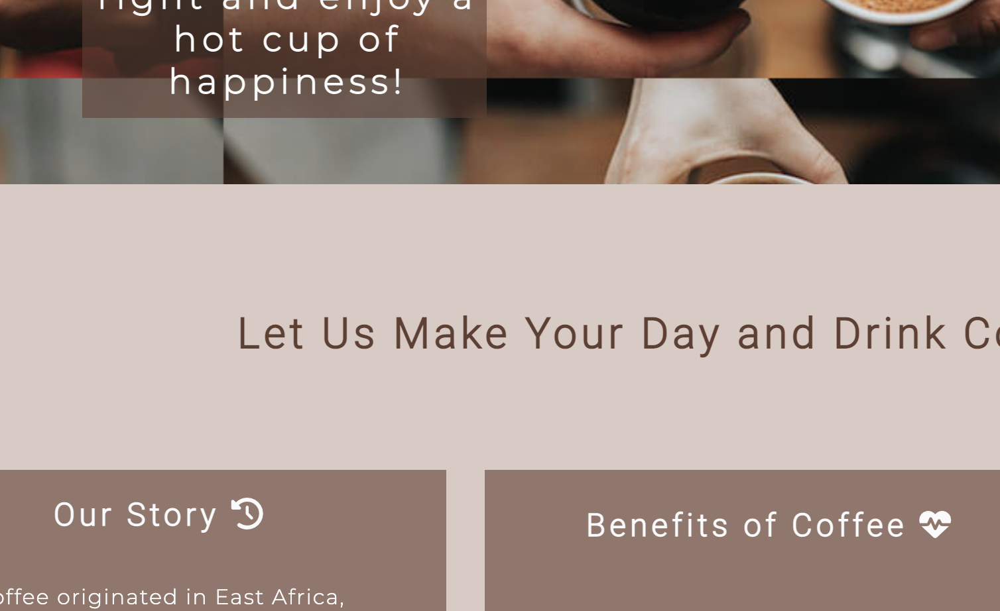
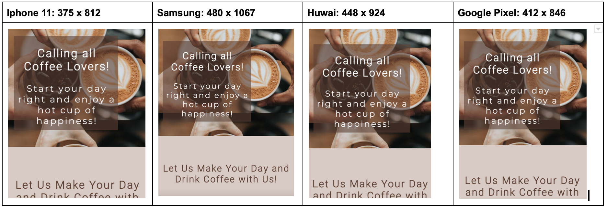

# The Coffee Joint

[View my live project here](https://8000-dinakidane-thecoffeejoi-dzy8zyltpkb.ws-eu85.gitpod.io/index.html)

The Coffee Joint website facilitates the promotion of a fictitious London-based cafe company. The company specialises in the sale of various caffeinated and decaffeinated drinks. This is followed by a small selection of pastries and bakery. Those who identify as coffee enthusiasts are the target audience for the website. In addition to coffee enthusiasts, it concentrates on those who want to broaden their coffee palate by utilising the diversity of beverages available. The Coffee Joint is the best spot to obtain coffee because of its relatable history as well as the high calibre of the brew. The website is helpful for anyone who want to know where we are located, what products we sell and when we are open.

## User Experience

### Target Audience
- People who are regular customers at the Cafe
- People who are interested in coming to the Cafe for the first time
- People who are familiar with coffee, but now want to broaden their taste in coffee 

### User Stories

- Regular customers and coffee enthusiasts
    - They are able to register for a Coffee Joint card to redeem points and recieve rewards, motivating them to buy drinks as often as they can.

- Those who are new to the cafe
    - They are able easily navigate through the site  to look at the location and opening times of the Coffee Joint.
    - They are able to look at the history and values of the Cafe to understand the background and where it came from.

- Those who are familiar with coffee but what to broaden their taste in it 
    - There is a variety of different types of coffee available, as well as multiple choices of add ons to alter their beverage in the way they would like
    - There are social media links on every page that are set at the bottom. They are able to ask questions at any time by directly messaging the Coffee Joint page on all social media sites.

## Features

### Existing Features

- __Navigation Bar__
    
    - The entire responsive navigation bar, which is present on all three pages and remains unchanged on each one for the convenience of users, contains links to the Logo, Home page, Menu, and Register page. 
    - This section will make it simple for users to move between pages on all devices without having to use the "back" button to go back to the previous page.
    - Visitors will be able to surf the website for longer if they feel secure in their location and the information it offers. Searches can be done by visitors with ease thanks to navigation.

    
    

- __Landing Page Image__

    - The image illustrates 3 cups of coffee, to clearly portray that this is a website for a Cafe. 
    - A text overlay is also included on top of the picture with a catchy slogan to attract customers. It clearly states one of the target audiences, coffee lovers, which would attract them to browse the site.

    

- __About Us__

    - The about us section aims to entice people to make the Cafe Joint the place to get their 'go-to' coffee.
    - It includes a section about the history of the Cafe, the benefits of Coffee and the values that they aim to keep.
    - These three sections attempt to establish a relationship with visitors to the site by giving users a taste of what the Coffee Joint is all about. As a result, new clients are drawn in as they discover the cafe's history.

    

- __Location and Opening Times__

    - To make things simpler for the user, this section will allow them to see the exact time the cafe opens in addition to its precise location and closest train station.
    - This is displayed below the About Us section as it is extra information for new customers who may want to visit the Cafe.

    

- __Footer__

    - Links to the appropriate social networking platforms for The Coffee Joint are provided in the footer area. 
    - In order to facilitate user navigation, the links will open in a new tab. The user benefits from the footer since it encourages them to maintain their social network connections.

    

- __Menu Page__

    - The menu will include the beverages and a small selection of pastries and bakery food. This is also followed by the list of add-ons that are available and the prices for each product. 
    - It also portrays the variety of products we sell, allowing customers to have a range of options to choose from.
    - The menu page also gives a sense of communication between the Cafe and online users as relevant information is being shared with them.

    

- __Register Page__

    - On this page, the user is able to sign up for a Coffee Joint card to collect points, which will eventually lead to rewards.
    - The main aim for this is to motivate customers to get their beverages from the Coffee Joint, allowing a rapport to also be built between the Cafe and the customers.
    - This is done by the online user adding their full name, email and address to the form and clicking on the register button. 
    - The form also gives an option to the user to allow them to decide whether they want to recieve news and deals from the Cafe.
    
    

### Features Left to Implement

- Another feature that would be implemented in the future is a sticky navigation bar, specifically in the homepage. 
- This would have made it easier for online users to navigate between pages or parts of a website while keeping track of where they are in relation to the page's scrolling. 
- It also would've made it quicker for them to browse the site.

## Design

### Colour Scheme

- A consistent shade of brown is used throughout the website. The transparency of the brown is aimed to bring out the main image more. 
- The image below shows the 3 different shades of brown. These shades of brown were used consistently, as they were considered to be suitable to use as it fits in with the theme of coffee and cafes. 

### Imagery

- The main image used remains throughout the site. This ensures that the online user, especially a new user, does not feel overwhelmed with a lot of images. Hence, the simplicity in using only one main image throughout the site.

### Typography 

- Pairing the Roboto and Montserrat font styles together was to bring out a modern feel to the website, as well as maintain simplicity and a clear read for the user. 

## Technologies Used 

### Languages used 

- HTML
- CSS3

### Frameworks, Libraries & Programs Used

- [Google Fonts](https://fonts.google.com/) was imported onto the style.css file to ensure that Robot and Montserrat was used throughout the site
- [Font Awesome](https://fontawesome.com/v5/search) was used to insert icons for the social media platforms and the icons in the home and menu page to represent the subtitle that it was next to. This was used to enhance aestheic appeal.
- [Git](https://git-scm.com/) committing to Git and pushing to github allowed the utlisation of the gitpod terminal.
- [Github](https://github.com/) The code that has been pushed from Git has been stored in github

## Testing

### Validator Testing

- [W3C Testing for HTML](https://validator.w3.org/#validate_by_input)
    - The closing unordered list element was missing on line 93 in index.html
    - The closing footer element wasn't aligned under the opening footer properly
     
    - All errors have now been fixed - The result for index.html, menu.html and register.html:
        - 

- [W3C Testing for CSS](https://jigsaw.w3.org/css-validator/#validate_by_input)
    - There was an error that declared that position: left was not a valid value.
    - All errors have now been fixed:
        - 

### Browser Compatibility

- Tested on:
    - Google Chrome on macOS 110.0.5481.177
    - Safari on macOS X 10.11 El Capitan
    - Microsoft Edge Version 110.0. 1587.41

### Testing the features

### Responsiveness

### Unfixed Bugs

The register button border box has changed shape and its font color, but this has only happened on a mobile screen. The solution to this bug has still not been found. 

### Fixed Bugs

- The text overlay on the landing page wasn't clearly visible in a mobile screen because it got cut off. 
- The position of the text overlay has changed and now the text overlay is visible on an Iphone 11, as well as the other phones shown below.
- The change was edited in the style.css.

## Deployment

### The Deployment of the website

- Go to the repository on Github and click on the settings icon
- On the left hand side of the site, click on Pages
- Click on 'source' and then click on deploy from branch
- Click on main to ensure that it deploys from the main branch
- Everything that has been git pushed will be pushed onto this specific branch
- It'll then be refreshed and the link to the deployed website will be on there
- This is the deployed link: [https://8000-dinakidane-thecoffeejoi-dzy8zyltpkb.ws-eu85.gitpod.io/index.html](https://8000-dinakidane-thecoffeejoi-dzy8zyltpkb.ws-eu85.gitpod.io/index.html)

## Credits

### Content

- The benefits of coffee section on the home page were mostly inspired from a [Healthline website](https://www.healthline.com/nutrition/top-evidence-based-health-benefits-of-coffee)
- The products on the menu page were inspired by the [Starbucks Menu](https://www.starbucks.co.uk/menu)
- The idea of the Coffee Joint card on the Register page was inspired by the [Starbucks Rewards System](https://www.starbucks.co.uk/rewards)
- Every icon on the home and menu page was from [Font Awesome](https://fontawesome.com/v5/search)

### Media

- Images
    - Landing page image that is used consistely throughout all web pages is from [Google images](https://lh3.googleusercontent.com/Ph9dCaH2FSr-pTdoKEqJftR0e_vpUwh0RxRR-d4lyA_D8qrqMN0aMwRs1UsCPNuGFvDdoGGWK1uE5Op46A-UnjMJiXxoQBU-fgsg8ZE)
    - The 'But first, Coffee' image was imported from a website called [pngtree](https://pngtree.com/freepng/but-first-coffee-quote-lettering-typography_5696318.html)

- Fonts
    - The main font style that was used, Roboto and Montserrat, were found on [Google Fonts](https://fonts.google.com/)
    - The inspiration to pair these two fonts together came from this site: [36 perfect font pairings](https://www.creativebloq.com/typography/20-perfect-type-pairings-3132120)

- Code
    - [To understand flexbox](https://www.youtube.com/watch?v=9e-lWQdO-DA) 
    - [To keep the footer at the bottom of the page](https://matthewjamestaylor.com/bottom-footer)
    - [To ensure that an accurate colour code was used](https://www.w3schools.com/cssref/css_colors.php)

index page - contents

user experience
    intended audience
    goals for:
        first time visitor
        return visitor
        frequent visitor
