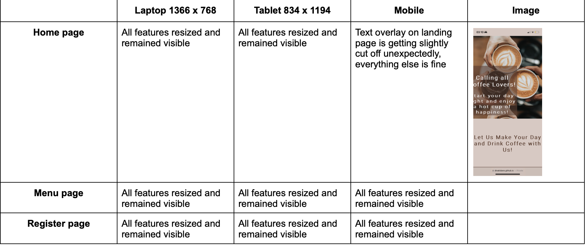

# The Coffee Joint

[View my live project here](https://8000-dinakidane-thecoffeejoi-dzy8zyltpkb.ws-eu85.gitpod.io/index.html)

The Coffee Joint website facilitates the promotion of a fictitious London-based cafe company. The company specialises in the sale of various caffeinated and decaffeinated drinks. This is followed by a small selection of pastries and bakery. Those who identify as coffee enthusiasts are the target audience for the website. In addition to coffee enthusiasts, it concentrates on those who want to broaden their coffee palate by utilising the diversity of beverages available. The Coffee Joint is the best spot to obtain coffee because of its relatable history as well as the high calibre of the brew. The website is helpful for anyone who want to know where we are located, what products we sell and when we are open.

## Features

### Existing Features

- __Navigation Bar__
    
    - The entire responsive navigation bar, which is present on all three pages and remains unchanged on each one for the convenience of users, contains links to the Logo, Home page, Menu, and Register page. 
    - This section will make it simple for users to move between pages on all devices without having to use the "back" button to go back to the previous page.
    - Visitors will be able to surf the website for longer if they feel secure in their location and the information it offers. Searches can be done by visitors with ease thanks to navigation.

    
    

- __Landing Page Image__

    - The image illustrates 3 cups of coffee, to clearly portray that this is a website for a Cafe. 
    - A text overlay is also included on top of the picture with a catchy slogan to attract customers. It clearly states one of the target audiences, coffee lovers, which would attract them to browse the site.

    

- __About Us__

    - The about us section aims to entice people to make the Cafe Joint the place to get their 'go-to' coffee.
    - It includes a section about the history of the Cafe, the benefits of Coffee and the values that they aim to keep.
    - These three sections attempt to establish a relationship with visitors to the site by giving users a taste of what the Coffee Joint is all about. As a result, new clients are drawn in as they discover the cafe's history.

    

- __Location and Opening Times__

    - To make things simpler for the user, this section will allow them to see the exact time the cafe opens in addition to its precise location and closest train station.
    - This is displayed below the About Us section as it is extra information for new customers who may want to visit the Cafe.

    

- __Footer__

    - Links to the appropriate social networking platforms for The Coffee Joint are provided in the footer area. 
    - In order to facilitate user navigation, the links will open in a new tab. The user benefits from the footer since it encourages them to maintain their social network connections.

    

- __Menu Page__

    - The menu will include the beverages and a small selection of pastries and bakery food. This is also followed by the list of add-ons that are available and the prices for each product. 
    - It also portrays the variety of products we sell, allowing customers to have a range of options to choose from.
    - The menu page also gives a sense of communication between the Cafe and online users as relevant information is being shared with them.

    

- __Register Page__

    - On this page, the user is able to sign up for a Coffee Joint card to collect points, which will eventually lead to rewards.
    - The main aim for this is to motivate customers to get their beverages from the Coffee Joint, allowing a rapport to also be built between the Cafe and the customers.
    - This is done by the online user adding their full name, email and address to the form and clicking on the register button. 
    - The form also gives an option to the user to allow them to decide whether they want to recieve news and deals from the Cafe.
    
    

### Features Left to Implement

- Another feature that would be implemented in the future is a sticky navigation bar, specifically in the homepage. 
- This would have made it easier for online users to navigate between pages or parts of a website while keeping track of where they are in relation to the page's scrolling. 
- It also would've made it quicker for them to browse the site.

## Testing

### Validator Testing

- [W3C Testing for HTML](https://validator.w3.org/#validate_by_input)
    - The closing unordered list element was missing on line 93 in index.html
    - The closing footer element wasn't aligned under the opening footer properly
     
    - All errors have now been fixed - The result for index.html, menu.html and register.html:
        - 

- [W3C Testing for CSS](https://jigsaw.w3.org/css-validator/#validate_by_input)
    - There was an error that declared that position: left was not a valid value.
    - All errors have now been fixed:
        - 

### Browser Compatibility

- Tested on:
    - Google Chrome on macOS 110.0.5481.177
    - Safari on macOS X 10.11 El Capitan
    - Microsoft Edge Version 110.0. 1587.41

### Testing the features

### Responsiveness

### Unfixed Bugs

In the testing for responsiveness, the text overlay

The register button border box has changed shape and its font color, but this has only happened on a mobile screen. The solution to this bug has still not been found. 

index page - contents

user experience
    intended audience
    goals for:
        first time visitor
        return visitor
        frequent visitor
